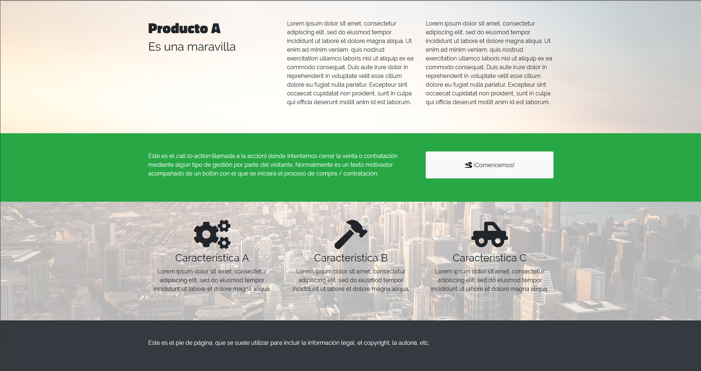

<h1>Landing page</h1>

Una landing page (pagina de destino o de aterrizaje) consiste en un sitio web de un solo apartado donde se presenta un producto concreto y se promueve su compra o contratacion. Es muy utilizada en campañas de marketing on-line, donde los anuncios de distintas plataformas (Google Ads, Facebook Ads, Instagram Ads, etc.) dirigen a la misma landing page.

El ejercicio consiste en crear la siguiente maquetacion y adaptarla al resto de resoluciones. La tipografia utilizada para el titulo es Titilium Web.

Maquetacion XL:

Maquetacion XS:

Imagen de fondo::

